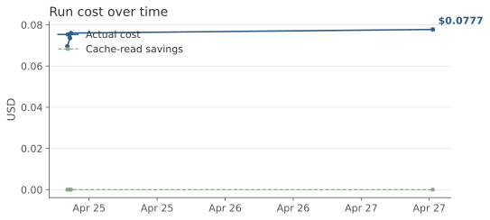
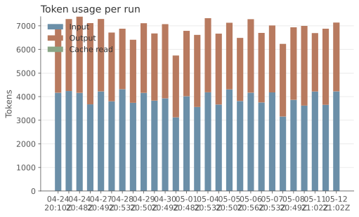
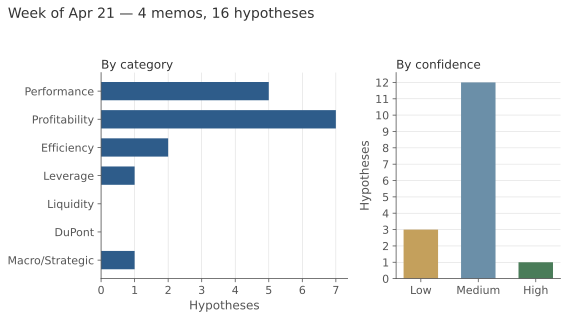

# Daily Market Hypothesis Evaluations

> Autonomous system scanning the US equity market and financial news twice per trading day, generating CFO-grade analytical hypotheses.  
> See [system spec](../docs/hypothesis-generator-spec.md) for design.

## Latest memo — May 12, 2026 — Pre-market

The tape is pricing a bifurcated macro view: semiconductor demand re-acceleration (QCOM +8.42%, MU +6.50%, INTC +3.62% on elevated volume) driving XLK to lead all sectors at +1.34%, while consumer discretionary and staples names (TGT -5.44%, WMT -2.18%, PEP -3.37%) sold off ahead of today's CPI print showing inflation at a 3-year high of 3.8%. Energy's +2.64% move in XLE appears driven by oil crossing $100 rather than fundamental demand strength, given the volume profile remains subdued at 0.67× average. The CFO should prioritize the semiconductor hypothesis — the 5-day moves (+35–41% for QCOM/MU/INTC) are too large to ignore and suggest either a major demand inflection or a sentiment overshoot that will reverse into earnings.

[Read full memo →](2026/05/2026-05-12-1245.md)

## Operational metrics

## This week

## Recent runs

| Date | Session | Hypotheses | Cost | Link |
|---|---|---:|---:|---|
| 2026-05-12 12:45Z | Pre-market | 4 | $0.0744 | [memo](2026/05/2026-05-12-1245.md) |
| 2026-05-11 21:02Z | Close | 4 | $0.0649 | [memo](2026/05/2026-05-11-2102.md) |
| 2026-05-11 13:04Z | Pre-market | 4 | $0.0766 | [memo](2026/05/2026-05-11-1304.md) |
| 2026-05-08 20:49Z | Close | 4 | $0.0728 | [memo](2026/05/2026-05-08-2049.md) |
| 2026-05-08 12:33Z | Pre-market | 4 | $0.0707 | [memo](2026/05/2026-05-08-1233.md) |
| 2026-05-07 20:53Z | Close | 4 | $0.0702 | [memo](2026/05/2026-05-07-2053.md) |
| 2026-05-07 12:42Z | Pre-market | 4 | $0.0706 | [memo](2026/05/2026-05-07-1242.md) |
| 2026-05-06 20:56Z | Close | 4 | $0.0743 | [memo](2026/05/2026-05-06-2056.md) |
| 2026-05-06 12:42Z | Pre-market | 4 | $0.0667 | [memo](2026/05/2026-05-06-1242.md) |
| 2026-05-05 20:50Z | Close | 4 | $0.0704 | [memo](2026/05/2026-05-05-2050.md) |

## How this runs

See the main [README](../README.md#daily-market-hypothesis-generator) for the schedule, manual trigger command, and a short description of each stage.
